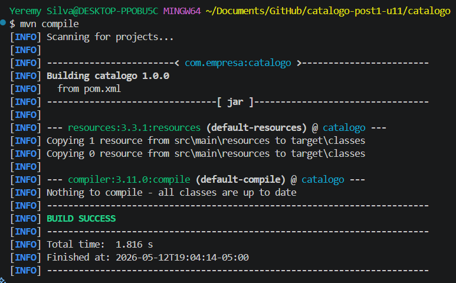
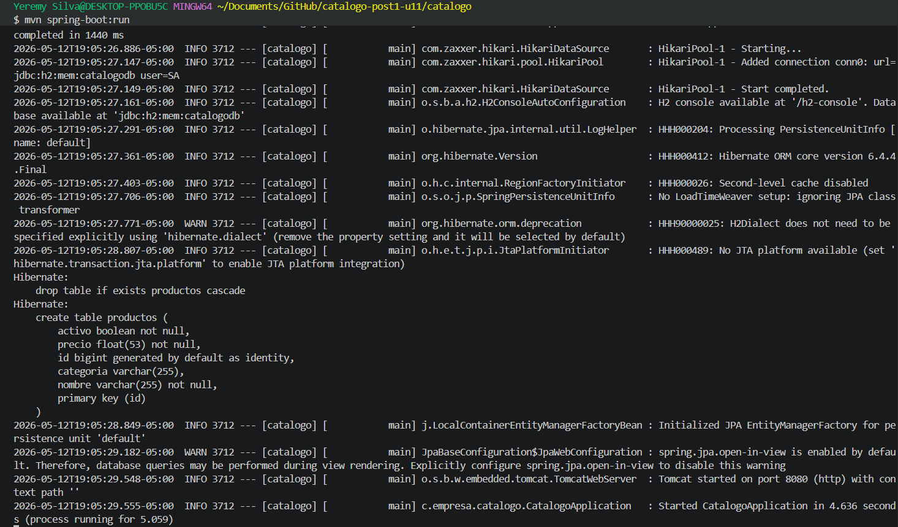
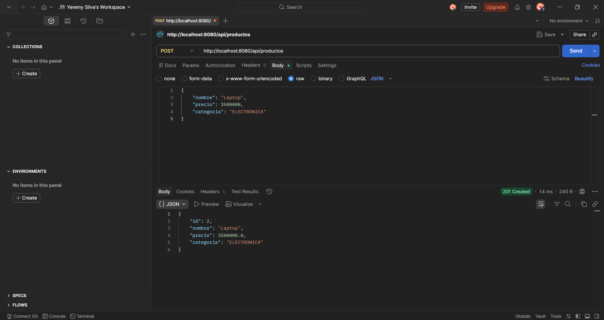
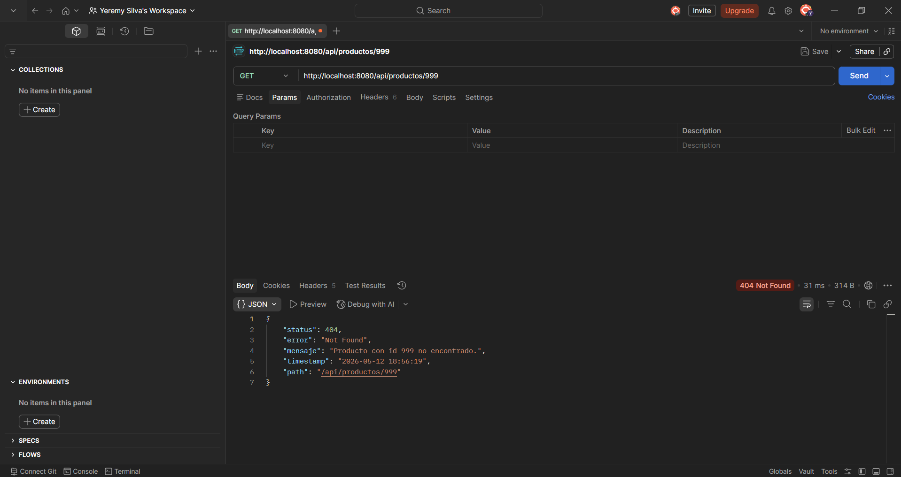
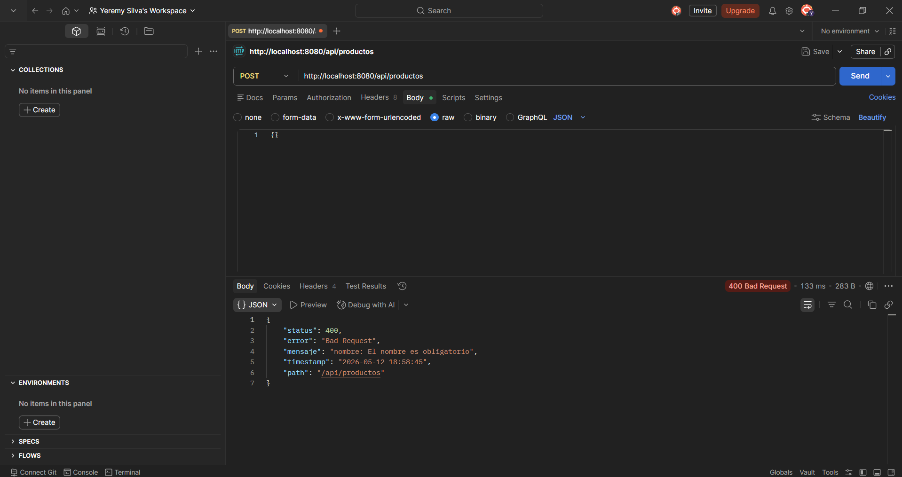

# Catálogo de Productos — Post-Contenido 1, Unidad 11

**Programación Web · Ingeniería de Sistemas · 2026**

Refactorización de una aplicación Spring Boot aplicando principios SOLID (SRP y DIP),
patrones DAO/DTO, Factory y manejo centralizado de excepciones con `@RestControllerAdvice`.

---

## Arquitectura en Capas

```
┌─────────────────────────────────────────────────────────────┐
│                      HTTP Request/Response                  │
└─────────────────────────┬───────────────────────────────────┘
                          │
         ┌────────────────▼────────────────┐
         │       ProductoController         │  ← Capa de presentación
         │   @RestController /api/productos │    Solo maneja HTTP
         └────────────────┬────────────────┘
                          │ depende de (DIP)
         ┌────────────────▼────────────────┐
         │       ProductoService (interfaz) │  ← Abstracción (DIP)
         │       ProductoServiceImpl        │  ← Lógica de negocio (SRP)
         └──────────┬─────────────┬────────┘
                    │             │
     ┌──────────────▼──┐   ┌──────▼──────────────┐
     │ ProductoRepository│   │  ProductoFactory    │
     │ (DAO / JpaRepo)   │   │  toEntity()         │
     │ findByActivoTrue()│   │  toResponseDTO()    │
     └──────────┬────────┘   └──────────────────────┘
                │
     ┌──────────▼────────────────────────────────────┐
     │               H2 Database (en memoria)         │
     └────────────────────────────────────────────────┘

DTOs:
  ProductoRequestDTO  → Cliente ──► API   (con validaciones @NotBlank, @Positive)
  ProductoResponseDTO → API    ──► Cliente (solo campos públicos, sin 'activo')

Excepciones:
  EntityNotFoundException ──► GlobalExceptionHandler ──► ApiError (JSON)
```

---

## Principios Aplicados

| Principio | Dónde se aplica |
|-----------|-----------------|
| **SRP** (Single Responsibility) | Cada clase tiene una sola razón de cambio: Controller (HTTP), Service (negocio), Repository (BD), Factory (conversión), DTOs (transporte) |
| **DIP** (Dependency Inversion) | `ProductoController` depende de `ProductoService` (interfaz). `ProductoServiceImpl` depende de `ProductoRepository` (interfaz de Spring Data) |
| **DAO Pattern** | `ProductoRepository` extiende `JpaRepository` — abstrae el acceso a datos |
| **DTO Pattern** | `ProductoRequestDTO` / `ProductoResponseDTO` — separan la entidad de la API |
| **Factory Pattern** | `ProductoFactory` — centraliza la conversión entre entidad y DTOs |

---

## Requisitos

- Java 17+
- Maven 3.9.x
- IDE: IntelliJ IDEA o VS Code con Extension Pack for Java

---

## Ejecución

### 1. Clonar el repositorio

```bash
git clone https://github.com/TU_USUARIO/apellido-post1-u11.git
cd apellido-post1-u11
```

### 2. Compilar el proyecto

```bash
mvn compile
```

### 3. Iniciar la aplicación

```bash
mvn spring-boot:run
```

La aplicación estará disponible en `http://localhost:8080`

---

## Endpoints disponibles

| Método | URL | Descripción |
|--------|-----|-------------|
| `POST` | `/api/productos` | Crea un nuevo producto |
| `GET` | `/api/productos` | Lista productos activos |
| `GET` | `/api/productos/{id}` | Busca producto por id |
| `DELETE` | `/api/productos/{id}` | Elimina un producto |

---

## Ejemplos con curl

### Checkpoint 2 — POST exitoso (201)

```bash
curl -X POST http://localhost:8080/api/productos \
  -H "Content-Type: application/json" \
  -d '{"nombre":"Laptop","precio":3500000,"categoria":"ELECTRONICA"}'
```

**Respuesta esperada:**
```json
{
  "id": 1,
  "nombre": "Laptop",
  "precio": 3500000.0,
  "categoria": "ELECTRONICA"
}
```

### GET lista de productos activos (200)

```bash
curl http://localhost:8080/api/productos
```

### Checkpoint 3 — GET con id inexistente (404)

```bash
curl http://localhost:8080/api/productos/999
```

**Respuesta esperada:**
```json
{
  "status": 404,
  "error": "Not Found",
  "mensaje": "Producto con id 999 no encontrado.",
  "timestamp": "2026-05-12 10:30:00",
  "path": "/api/productos/999"
}
```

### Checkpoint 3 — POST con body vacío (400)

```bash
curl -X POST http://localhost:8080/api/productos \
  -H "Content-Type: application/json" \
  -d '{}'
```

**Respuesta esperada:**
```json
{
  "status": 400,
  "error": "Bad Request",
  "mensaje": "nombre: El nombre es obligatorio; precio: El precio debe ser mayor a cero",
  "timestamp": "2026-05-12 10:30:00",
  "path": "/api/productos"
}
```

---

## Evidencias

### Checkpoint 1 — Compilación exitosa





### Checkpoint 2 — POST exitoso retornando DTO



### Checkpoint 3 — Manejo de errores





---

## Consola H2 (opcional)

Con la aplicación corriendo, ingresa a `http://localhost:8080/h2-console`:
- JDBC URL: `jdbc:h2:mem:catalogodb`
- User: `sa`
- Password: *(vacío)*

---

## Estructura del Proyecto

```
src/main/java/com/empresa/catalogo/
├── CatalogoApplication.java
├── controller/
│   └── ProductoController.java
├── service/
│   ├── ProductoService.java        (interfaz)
│   └── ProductoServiceImpl.java    (implementación)
├── repository/
│   └── ProductoRepository.java
├── dto/
│   ├── ProductoRequestDTO.java
│   └── ProductoResponseDTO.java
├── entity/
│   └── Producto.java
├── factory/
│   └── ProductoFactory.java
└── exception/
    ├── ApiError.java
    ├── EntityNotFoundException.java
    └── GlobalExceptionHandler.java
```
